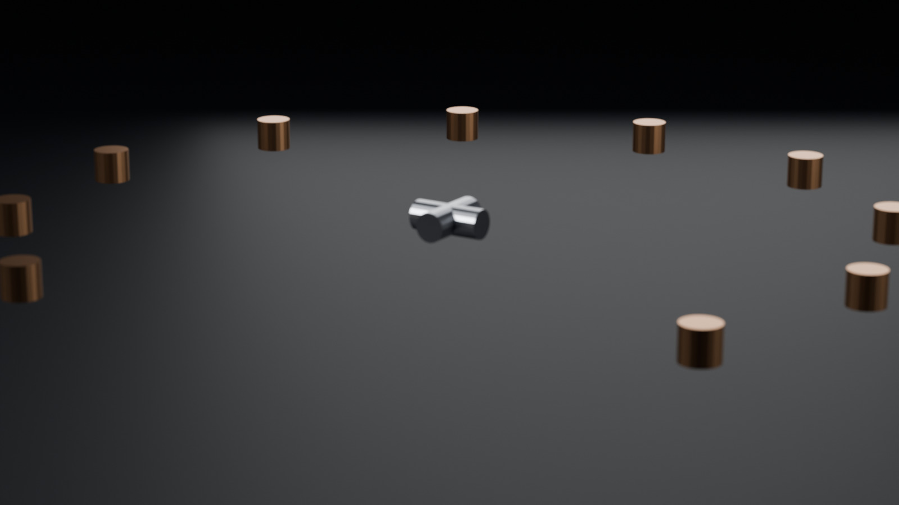
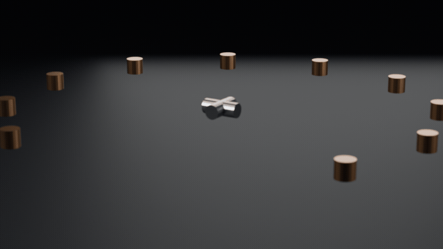
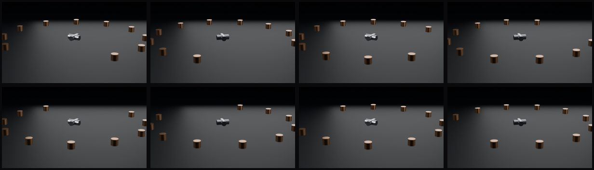

# Mechanical gimbal turntable — Blender + Cycles

**What this proves:** the DCC‑MCP Blender adapter can be booted inside a real
Blender 5.1.1 host on a plain Windows machine, and that host can then build a
24‑part mechanical assembly from nothing, light it, and render both a hero frame
and a seamless 48‑frame turntable — with every published number traceable to a
machine‑readable record.



## The artifacts

| File | Spec | What it proves |
| --- | --- | --- |
| `hero_v2.jpg` | 1600×900, 53 KB, JPEG q82 | A real Cycles GPU render: mean luma 53.8, std 34.9, 72.9 % of pixels lit, subject centred at uv (0.516, 0.629) |
| `turntable_v2.gif` | 900×506, 48 frames, 12.00 fps, 2.66 MB, loops forever | 48 rendered frames, every inter‑frame step non‑zero, and the loop seam statistically indistinguishable from any other step |
| `contact_sheet_v2.jpg` | 1232×354, 27 KB, 4×2 grid | Eight evenly spaced samples across the rotation, so the motion claim is checkable by eye |
| `showcase_v2.blend` | 98 KB | The source scene. Re‑render it and you regenerate both the hero frame and the turntable |





## How it was driven

The chain, in order, with the evidence that survived each step:

1. **Host launch.** Blender 5.1.1 starts and runs a bootstrap inside its own
   interpreter. The host itself reports `blender_version=5.1.1` and
   `python=3.13.9`, so the host identity is self‑reported by the live process,
   not assumed.
2. **Adapter boot — and a real failure that had to be fixed.** The first
   `import dcc_mcp_blender` fails:

   ```text
   BOOT resolved import_failed=ModuleNotFoundError("No module named 'dcc_mcp_blender'")
   BOOT add_root=<adapter site-packages> ok=True
   BOOT add_root=<core site-packages>      ok=True
   BOOT add_root=<adapter addons>          ok=True
   BOOT injected dcc_mcp_blender=<adapter>/dcc_mcp_blender/__init__.py
   BOOT blender_version=5.1.1
   ```

   Blender 5.x runs an isolated interpreter that does not inherit the exported
   package path, so the adapter is unimportable on a plain host start. Injecting
   the resolved adapter and core roots fixed it: 3 roots injected, 3 resolved.
   This is the single most useful thing in this entry — it is a concrete,
   reproducible packaging failure and its fix, not a screenshot.
3. **Scene build.** 24 objects (9 body parts, 12 radial bolts, 2 axial pins, 1
   floor), 5 materials, 4 area lights, an 85 mm camera with depth of field. The
   build report’s `errors` array is empty.
4. **Render.** Cycles on GPU: hero at 512 samples with OpenImageDenoise in
   6.01 s; 48 turntable frames at 320 samples each, 1.57–1.82 s per frame,
   80.23 s total.
5. **Encode.** 48 frames to a 128‑colour palettised GIF.

## Measurements

Every figure below comes from `validation.json` or `manifest.json`.

| Quantity | Value |
| --- | --- |
| Host | Blender 5.1.1, CPython 3.13.9, Windows |
| Adapter | `dcc_mcp_blender` 0.2.4, `dcc_mcp_core` 0.20.28 |
| Renderer | Cycles, GPU |
| Scene | 24 objects, 5 materials, 4 area lights |
| Camera | 85 mm, at (5.054, 3.158, 2.759), rotation (74°, 0°, 122°), DoF on |
| Hero | 1600×900, 512 samples, 6.01 s, mean luma 53.92 / std 34.86 |
| Turntable | 48 frames, 320 samples/frame, 80.23 s total, luma drift 0.007 |

**The hero numbers were recomputed independently.** Reading `hero_v2.png`
afresh gives mean luma 53.8 and std 34.9, against the producing run’s 53.92 and
34.86. The two agree to within 0.15, so the published statistics are not merely
whatever the job happened to log.

**The turntable is genuinely moving, and it loops cleanly.** Inter‑frame steps
run 2.717–4.0098 with a mean of 3.5239; independently recomputing on the
palettised GIF gives 2.644–3.920. The last‑to‑first step is 3.1473 (z = −1.088),
inside the normal step range, so the loop seam is not detectable as a jump.

**Iteration is visible in the numbers.** Luma drift across the cycle fell from
10.618 in the first attempt, to 6.361 in an intermediate rework, to 0.007 here.
That is a quality bar being met, not asserted.

## A recorded deviation: GIF frame timing

The contract caps GIFs at 12 fps. The GIF stores delays in 10 ms units, and
1000 ÷ 12 = 83.33 ms is not representable, so the encoder alternates 80 ms and
90 ms delays to average 83.33 ms. Total cycle time is exactly 4.000 s and the
mean frame rate is exactly 12.00 fps, but 8 of the 48 frames carry an 80 ms
delay and therefore play at 12.5 fps instantaneously.

We are declaring this rather than hiding it. It is a limitation of the GIF
format, not of the render, and re‑encoding at a lower nominal rate would only
trade one artefact for another.

## What this entry does *not* claim

This is the part that matters most for reading everything above correctly.

- **No MCP tool round trip.** The adapter was booted inside the host, but the
  scene was built and rendered through Blender’s Python API. The job issued no
  `tools/call` requests, so the adapter’s *tool surface* was not exercised by
  the run that produced these frames.
- **No sustained interactive MCP session.** Long‑lived background hosts are
  reaped between agent tool calls in this environment, so the job ran as a
  single in‑process invocation.
- **`dcc_mcp_blender_launcher` was not installed**, so automatic MCP server
  startup on host launch was never exercised.
- **No cross‑host conservation.** One host, one entry.
- **No geometric ground truth.** No mesh, vertex, UV or shader values were
  measured. Every visual claim rests on the luma statistics above.
- **No aesthetic sign‑off.** Composition is expressed only through the measured
  subject centre, coverage and lit‑area fractions.

Verification level: **host‑level execution with the adapter booted in‑process**.
Not “agent drove the host over MCP end to end”.

## Reproducing

```bash
python scripts/validate_entry.py docs/showcase/blender-mcp-gimbal-turntable
```

The validator checks that the mandatory files exist, that every artifact listed
in `manifest.json` is present with the recorded size and SHA‑256, that there are
no orphan artifacts, and that `validation.json` has the required shape —
including a non‑empty `not_claimed` array.
