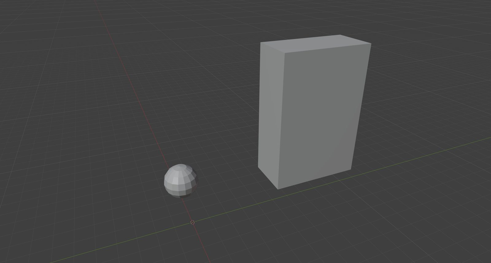
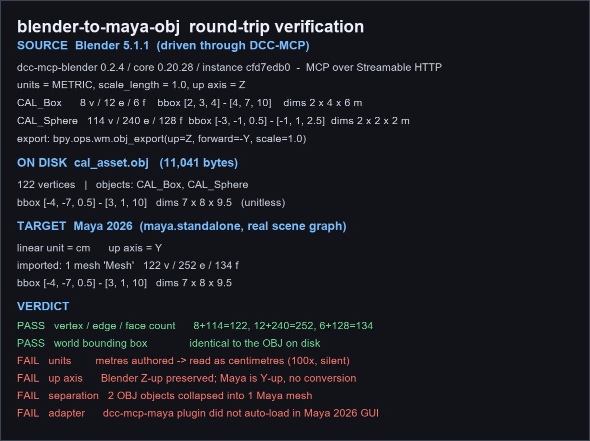

# Blender to Maya: what survives an OBJ round trip

> **Secondary entry — measurement contrast, not the headline sample.**
> The asset here is deliberately trivial. What this entry contributes is the
> *method*: how a cross‑host round trip is measured closely enough to catch
> faults that both hosts report as success. For the headline capability
> sample, see [`blender-mcp-gimbal-turntable`](../blender-mcp-gimbal-turntable/README.md).



A calibration asset — a 2 × 4 × 6 m box and a 2 m sphere, **122 vertices,
252 edges and 134 faces** in total — is built in Blender 5.1.1, exported to
OBJ, imported into Maya 2026 and measured again inside the target scene
graph. The asset is deliberately asymmetric on every axis so that a silent
axis swap, a unit rescale or a mirrored placement cannot hide inside the
numbers.

**Topology and extent survive. Units, up-axis and object separation do not.**
The vertex, edge and face counts come back identical, and the world bounding
box is bit-for-bit the same as the OBJ on disk — yet the 9.5 m asset is read
as 9.5 cm, the vertical extent arrives as depth, and the two OBJ objects
collapse into a single Maya mesh. None of those three is reported as an error
by either host.

[Blender capture](blender-source.jpg) · [Round-trip verdict](roundtrip-verdict.png) ·
[OBJ payload](cal_asset.obj) · [Validation](validation.json) · [File hashes](manifest.json)

## What was built

Both objects are created through the DCC-MCP Blender adapter and measured in
the scene before export. Blender runs METRIC units with `scale_length = 1.0`,
Z up.

| Object | Vertices | Edges | Faces | Bounding box (m) | Dimensions (m) |
| --- | --- | --- | --- | --- | --- |
| `CAL_Box` | 8 | 12 | 6 | `[2, 3, 4]` – `[4, 7, 10]` | 2 × 4 × 6 |
| `CAL_Sphere` | 114 | 240 | 128 | `[-3, -1, 0.5]` – `[-1, 1, 2.5]` | 2 × 2 × 2 |
| **Scene total** | **122** | **252** | **134** | `[-3, -1, 0.5]` – `[4, 7, 10]` | **7 × 8 × 9.5** |

The sphere is a UV sphere of 16 segments and 8 rings. The two objects are
placed off-origin and apart from each other on purpose — a centred asset
would make the placement transform below unmeasurable.

## Export

```python
bpy.ops.wm.obj_export(filepath=OBJ, global_scale=1.0, up_axis="Z",
                      forward_axis="NEGATIVE_Y", export_materials=False)
```

No materials are exported; the run measures geometry only.

## Three-way measurement

The same quantities are measured in three places: inside Blender before
export, from the OBJ bytes on disk, and inside Maya after import. The Blender
column below is reproducible from [`cal_asset.obj`](cal_asset.obj) and the
build parameters above without launching either host.

| Quantity | Blender (in scene) | OBJ (on disk) | Maya (imported) | Conserved |
| --- | --- | --- | --- | --- |
| Vertices | 122 | 122 | 122 | yes |
| Edges | 252 | — | 252 | yes |
| Faces | 134 | 134 | 134 | yes |
| Bounding box min | `[-3, -1, 0.5]` | `[-4, -7, 0.5]` | `[-4, -7, 0.5]` | **no** — see below |
| Bounding box max | `[4, 7, 10]` | `[3, 1, 10]` | `[3, 1, 10]` | **no** — see below |
| Dimensions | 7 × 8 × 9.5 | 7 × 8 × 9.5 | 7 × 8 × 9.5 | yes |
| Objects | 2 | 2 | 1 | **no** |
| Units | metres | unitless | centimetres | **no** |

The OBJ on disk is **11,041 bytes** and holds 2 objects and 122 vertices.

### The placement transform

Between Blender and the OBJ file the asset undergoes exactly one transform:

```text
(x, y, z) → (−x, −y, z)
```

a 180° rotation about the world Z axis. Blender's scene bounding box
`[-3, -1, 0.5] – [4, 7, 10]` negates to `[-4, -7, 0.5] – [3, 1, 10]`, which is
what the OBJ and Maya both report. Extent is unaffected, which is why the
dimensions row above stays green while the position rows do not. This is the
expected result of combining `up_axis="Z"` with `forward_axis="NEGATIVE_Y"`,
and it is the reason a symmetric asset is useless for this test.

Maya's OBJ importer then adds **no** transform of its own: the imported
bounding box matches the file byte-for-byte.

## What passed, and what did not



| Check | Result | Observed |
| --- | --- | --- |
| Vertex / edge / face count | **pass** | 8 + 114 = 122, 12 + 240 = 252, 6 + 128 = 134 |
| World bounding box vs OBJ on disk | **pass** | identical, `[-4, -7, 0.5] – [3, 1, 10]` |
| Units | **fail** | metres authored, read as centimetres — a silent 100× rescale |
| Up-axis | **fail** | Blender Z-up preserved; Maya is Y-up, no conversion applied |
| Object separation | **fail** | 2 OBJ objects collapse into 1 Maya mesh |
| Adapter availability on the target | **fail** | `dcc-mcp-maya` did not auto-load in the Maya 2026 GUI |

Two of the four failures are silent. No host raises an error for the unit
rescale, the axis mismatch or the object merge — the numbers simply arrive
wrong, and the only way to see it is to measure the same quantity on both
sides, which is what this entry is for.

## Reproducing

1. Open [`cal_asset.obj`](cal_asset.obj) in MeshLab, Blender or Maya and
   confirm 122 vertices, 252 edges and 134 faces.
2. In Maya, import the OBJ with the scene set to centimetres and compare the
   reported bounding box against `validation.json`. It will match this run.
3. Re-derive the Blender column from the build parameters in
   `validation.json` — it does not require Blender to be installed.

Verify the payload before trusting it:

```bash
sha256sum -c <(python -c "import json;d=json.load(open('manifest.json'));[print(f['sha256'],' ',f['path']) for f in d['files']]")
```

## What we deliberately do not claim

- **This is not an MCP round trip on the Maya side.** Blender was driven
  through DCC-MCP over Streamable HTTP (instance `cfd7edb0`, `dcc-mcp-blender`
  0.2.4, `core` 0.20.28). The Maya import ran through `maya.standalone`
  directly, because the `dcc-mcp-maya` plugin did not auto-load in the Maya
  2026 GUI. So this entry reaches **in-host** on both ends and **real tool
  return** on the Blender end, and it does **not** reach gateway or tool
  return on the Maya end. Orchestrating the import over MCP is a separate,
  unproven claim.
- **Geometry is the only thing tested.** No materials, UVs, normals,
  animation, layer or scene-hierarchy check was performed. The object merge in
  particular means hierarchy is untested here, not passing.
- **The failures are properties of the OBJ path as configured**, not of OBJ
  as a format. Different exporter axis settings or a different Maya import
  unit setting would change specific rows. The point of the entry is that
  none of those choices announce themselves.
- **One host pair, one version pair.** Blender 5.1.1 and Maya 2026, with the
  adapter and core versions recorded in `validation.json`. Nothing here
  generalises to other host versions.
