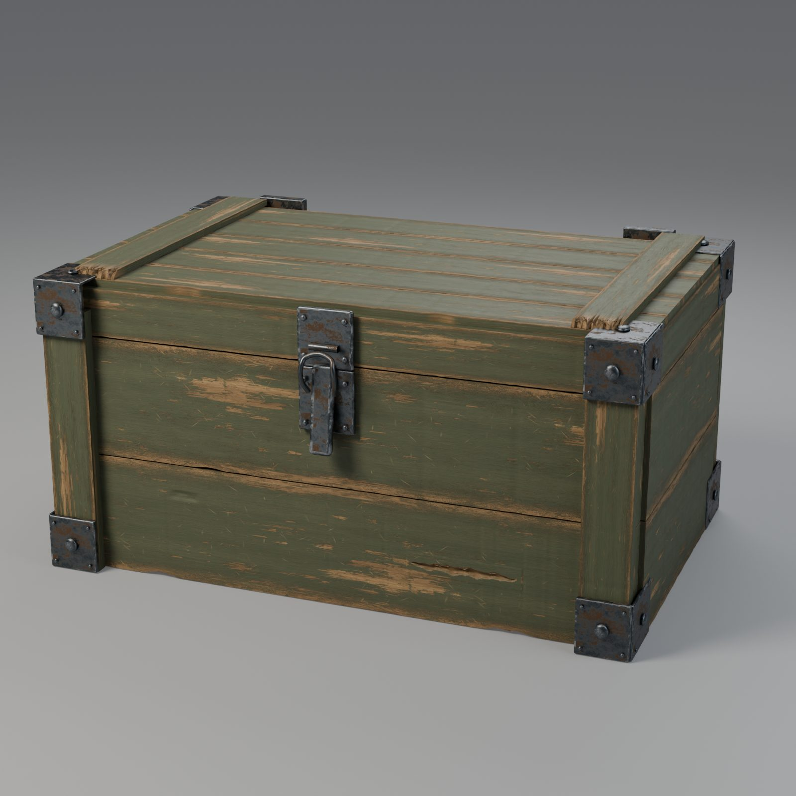
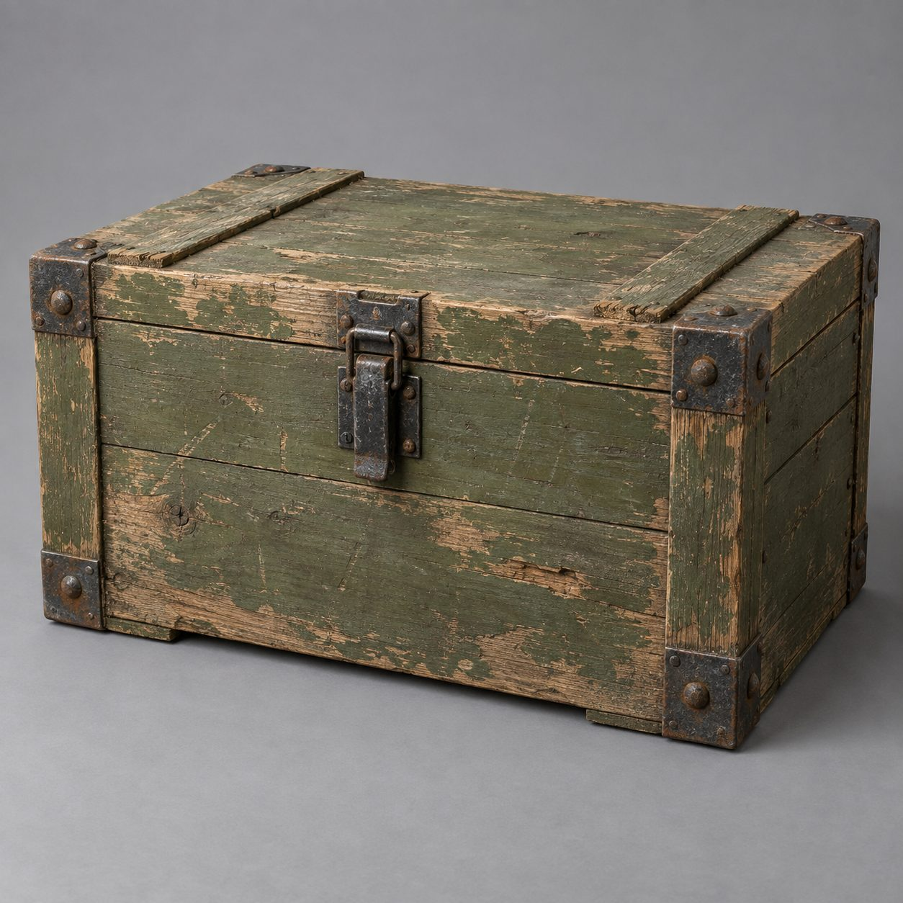
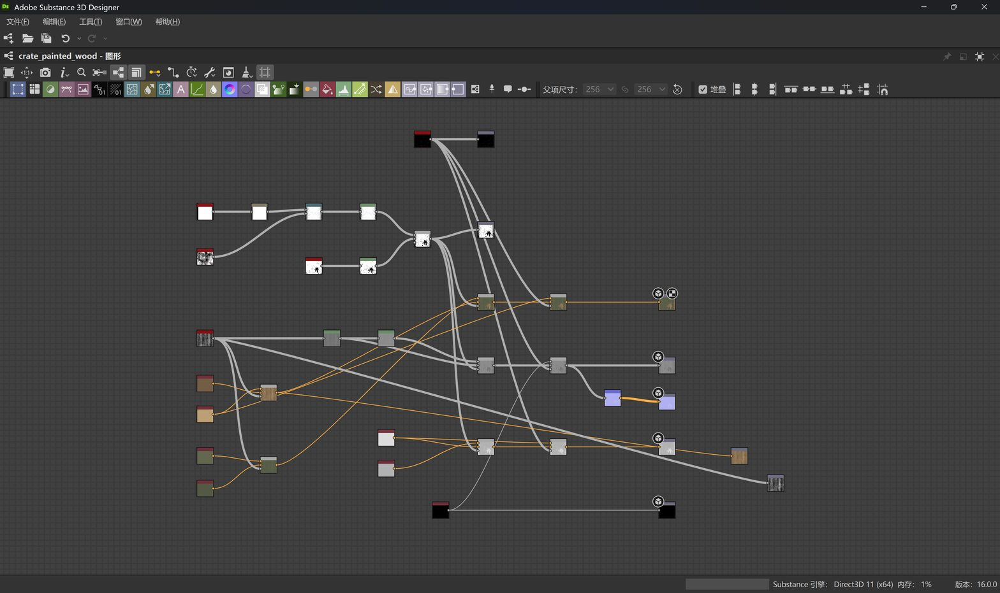
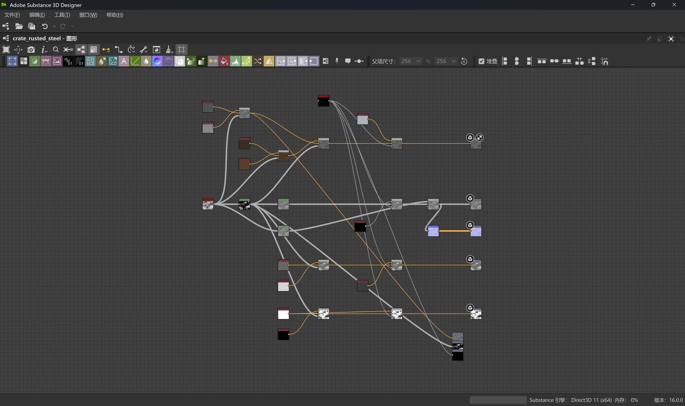
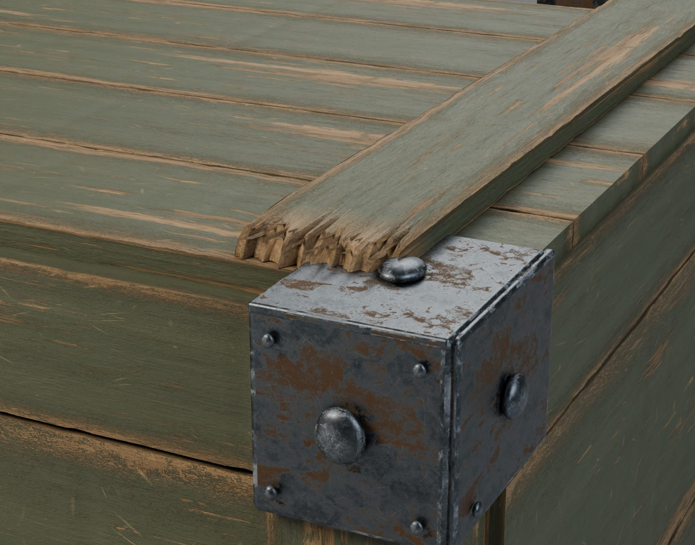
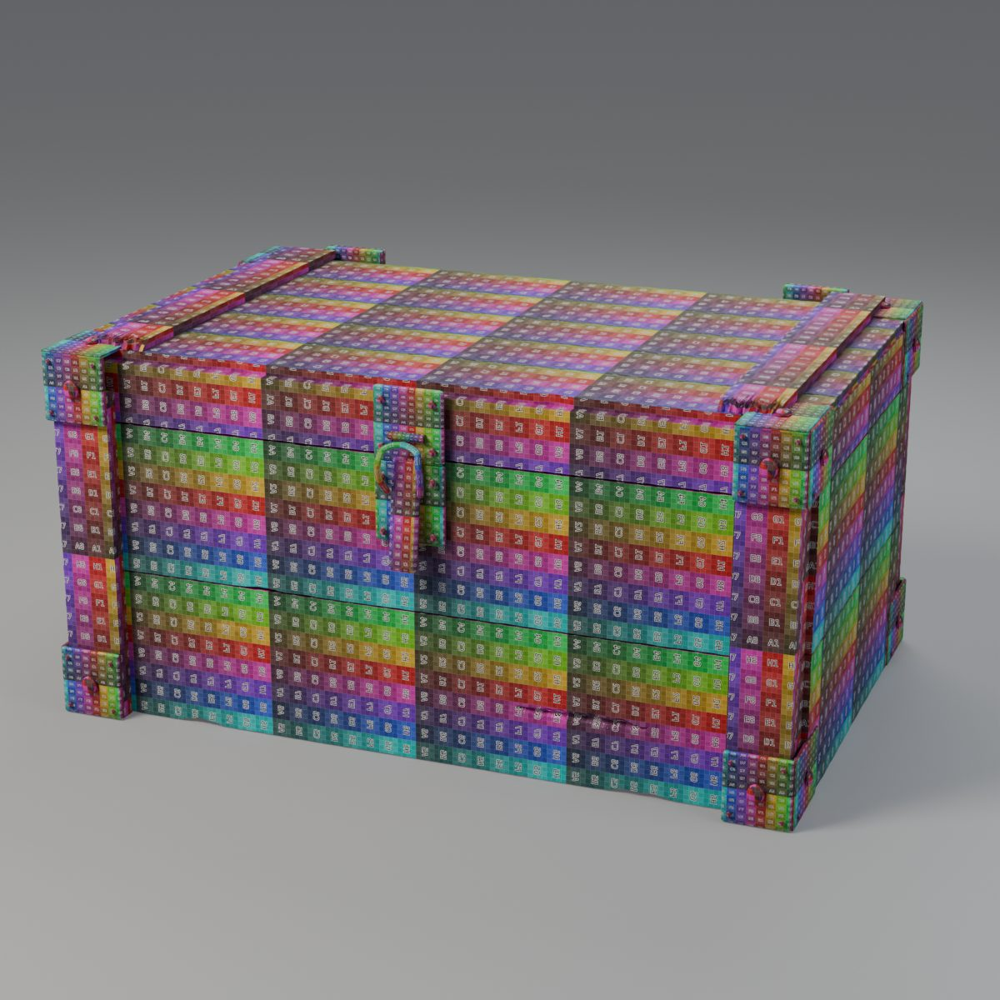
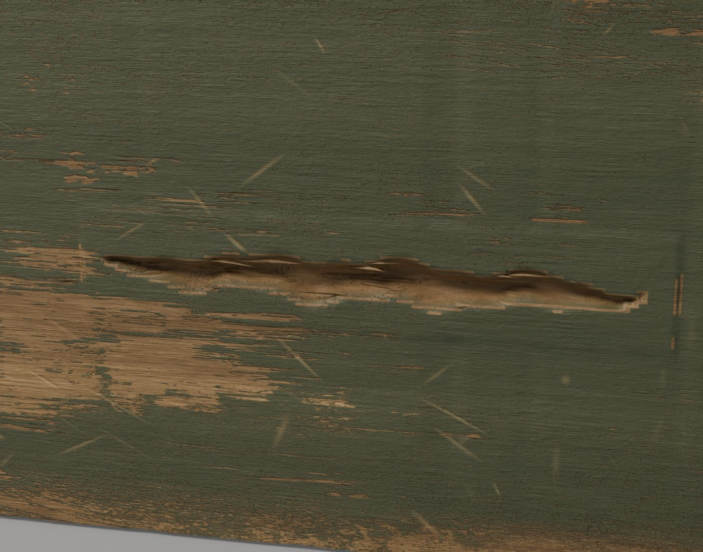
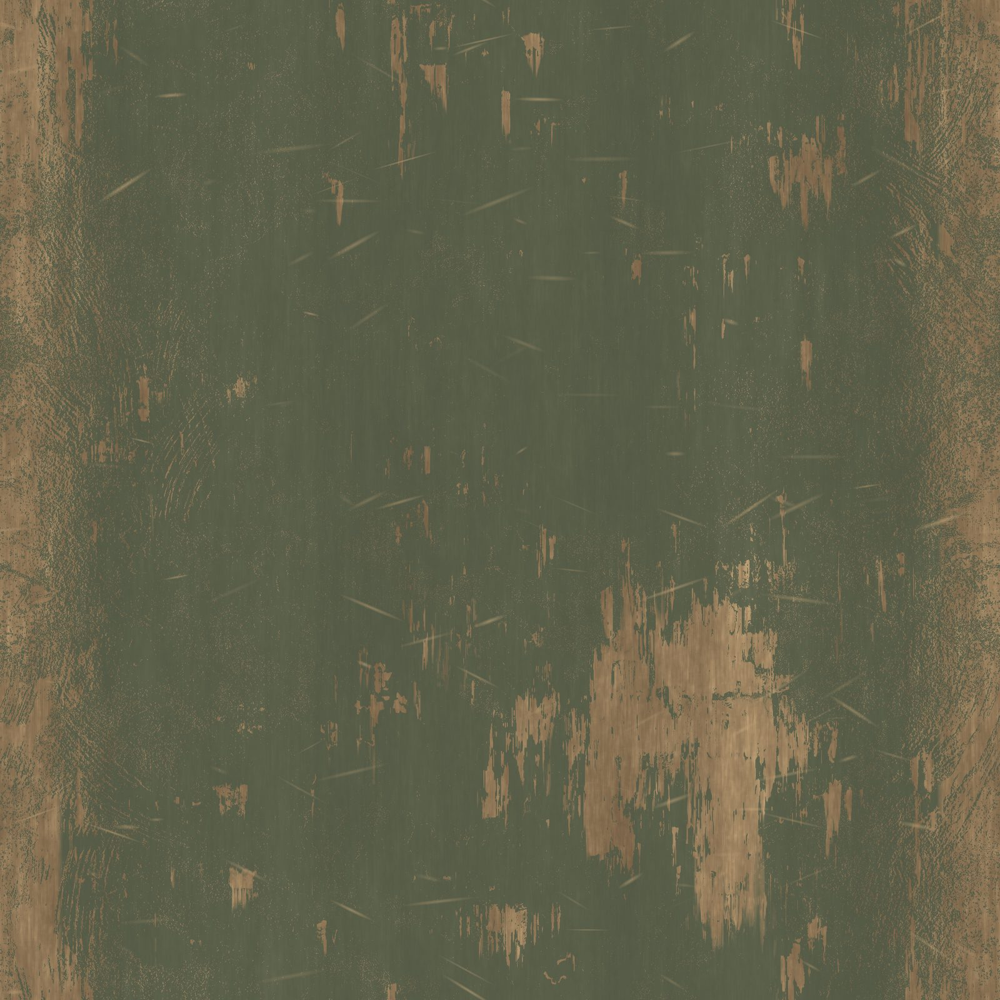
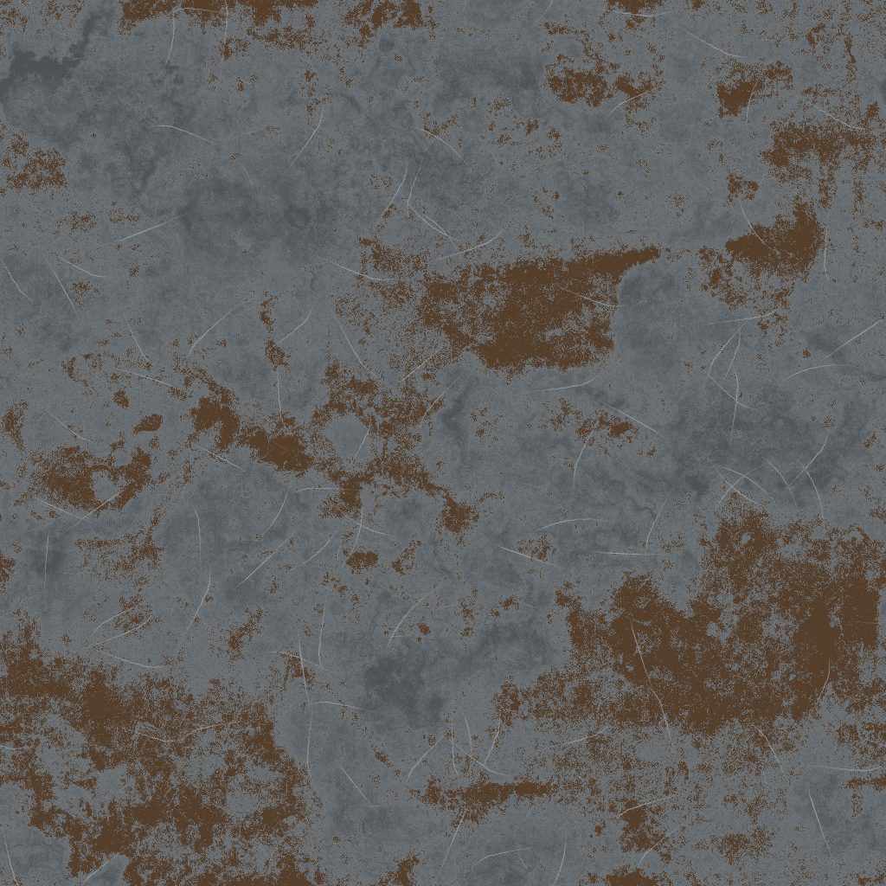
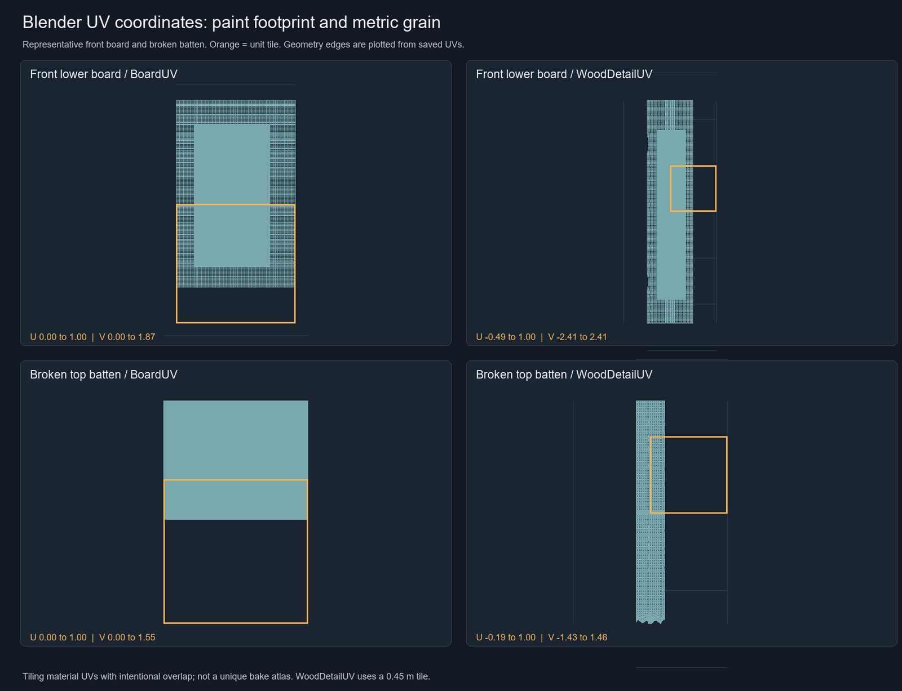

# 风化木箱：从 Designer 材质图到 Blender lookdev

把木纹、掉漆、铁锈与划痕分成可编辑材质图，再把厚度、断裂、纤维和接触阴影落实到一个可重开的木箱场景。178 个箱体网格、两套 Designer 图和 13 张打包贴图组成最终 lookdev。

> **公开案例 · 本轮未复现。** 整合 2026-09-10 发布的真实作品与源仓库测量记录。源报告声明 Blender 建模通过 DCC-MCP 完成；本轮仅下载、核对哈希、优化网页图和审阅公开证据，没有重新运行 Designer、Blender 或 DCC 工具。公开包未提供完整 tools/call 轨迹，不能据此声称本轮全程 MCP 复现。

[hero.jpg](hero.jpg) · [detail.jpg](detail.jpg) · [splinters.jpg](splinters.jpg) · [wood-color.jpg](wood-color.jpg) · [steel-color.jpg](steel-color.jpg) · [uv-layout.jpg](uv-layout.jpg) · [wood-graph.jpg](wood-graph.jpg) · [steel-graph.jpg](steel-graph.jpg) · [uv-checker.jpg](uv-checker.jpg) · [验证与证据范围](validation.json) · [文件清单](manifest.json) · [原图/网页副本映射](derivatives.json) · [源许可](LICENSE.source.txt)

## 目标与介绍

从已有参考建立一只约 2.2 m 长的风化木箱，保留宽木板、薄压条、金属包角和曲线锁扣。用程序化材质控制旧漆和锈蚀，以真实几何构造断裂轮廓，并让导出的 PBR 贴图在 Blender 中保持正确色彩空间与物理纹理密度。

## 提示词

**可复用改写，原始提示词未公开，本轮未执行。**

通过 DCC-MCP，在 Substance 3D Designer 与 Blender 中制作一只约 2.2 m 长的风化木箱。使用宽木板、30 mm 压条、包角铆钉与弯曲锁扣；橄榄绿油漆自然剥落，铁锈与划痕分别控制金属和粗糙度。压条应有多层断裂与附着的渐尖木纤维，前下板有渐尖凹痕。木材输出 2048×2048、钢材输出 1024×1024 PBR 贴图，保留可编辑 SBS/SBSAR；使用 sRGB 颜色贴图和 Non-Color 数据贴图。木纹细节保持约 0.45 m 一次的物理密度。让四个支脚与地面真实接触，使用 Cycles 输出主图、断裂与凹痕细节、UV 检查图和完整节点图。重新打开保存的场景与材质，核对贴图打包字节、网格数、包围盒和文件哈希。记录实际 MCP 工具调用；遇到不可用能力明确报告，不绕用直接软件脚本。

原始对话提示词没有公开。此文本根据公开 README 与 validation 改写，用于下一次复现；本轮未执行，也不是原始提示词。参考图原由 Codex 图像生成产生，属于历史输入，不是 DCC 成品。

## 软件与工具

| 项目 | 已公开信息 |
| --- | --- |
| 材质软件 | Substance 3D Designer 16.0.0 |
| 建模与渲染 | Blender 5.2.0 LTS · Cycles · 128 samples |
| 主图 | 1600 × 1600 · 源报告记录 |
| 图截图 | DCC-CUA 1.8.2 · 完整画面 |
| 适配器 / Core | 未公开记录（unrecorded） |

- **DCC-MCP / Blender（源报告）**：源 README 声明建模通过 DCC-MCP 完成；具体工具名、参数和原始 tools/call 日志没有公开。
- **Designer 材质图工作流（源报告）**：公开可编辑 SBS、SBSAR、完整节点图和原生导出贴图；具体 MCP 调用与适配器版本没有公开。
- **DCC-CUA 1.8.2**：源 manifest 记录节点图截图来源。截图展示 37 个木材与 35 个钢材作者节点，不展开 Adobe 库内部图。

## 分步过程

### 1. 确定结构与比例

按已有生成参考建立约 2.2 m 的长木箱，使用宽木板、30 mm 压条、包角和曲线锁扣。参考图只用于外观判断，尺寸、损伤与风化位置是艺术估计。

### 2. 构建旧漆木材图

37 个作者节点把 Wood Fibers、Grunge Leaky Paint、Shape 与 Directional Scratches 组合成油漆、裸木、刮痕及高度层；paint_coverage 保存为 0.735，额外的 16-bit grain 输出供 Blender 细节使用。

### 3. 构建锈蚀钢材图

35 个作者节点用 Grunge Rust Fine 分离非金属锈层与裸钢，划痕降低粗糙度并露出亮金属。源报告记录裸钢、铁锈和抛光刮痕粗糙度分别为 0.40、0.84、0.23。

### 4. 用几何建立断裂和纤维

箱体记录 178 个网格，其中 83 个木材网格、59 个附着纤维网格。分层断裂和渐尖凹痕改变轮廓；两根压条使用原生 16-bit 高度与细木纹，置换范围 0.004 m、midlevel 0.52。

### 5. 控制 UV 密度并检查接触

BoardUV 保留板材的漆磨损分布，WoodDetailUV 按 0.45 m 每次平铺统一细木纹密度。UV 使用重叠与平铺。源 validation 记录四个支脚与地面间隙均为 0.0 m。

### 6. 打包贴图并重开渲染

木材导出 2048×2048、钢材 1024×1024，场景打包 13 张图；颜色为 sRGB，数据为 Non-Color。源记录核对了打包图字节，并重开 SBS 与 Blender 场景，以 Cycles 128 samples 渲染主图。

## 最终与中间成果

最终 lookdev：1600×1600。当前为网页 JPEG，源 PNG 可从资源链接取得。

断裂轮廓来自几何，压条还使用真实置换。

渐尖凹痕与纤维细节。

木材 Base Color 网页预览；原始贴图 2048×2048。

钢材 Base Color；原始贴图 1024×1024。

实际 UV 坐标。源图 1800×1380，网页副本缩至 1600 px 宽。

## 验证证据

以下明确区分本轮资产核对与源报告的历史软件测量。

| 检查 | 结果 | 实际证据 |
| --- | --- | --- |
| 源图一致性（本轮） | 通过 | 9 张下载原图的 SHA-256 与原 manifest 一致；网页副本单独记录哈希。 |
| 保存后重开（历史记录） | 通过 | source-validation 记录 Blender reopened=true；木材 37 节点、钢材 35 节点均重开并原生重算。 |
| 打包与色彩空间（历史记录） | 通过 | 13 张打包图片；记录的材质图槽 packed_bytes_match_export=true，颜色 sRGB / 数据 Non-Color。 |
| 地面接触（历史记录） | 通过 | 四支脚 gap=0.0 m；箱体包围盒约 2.252 × 1.527 × 1.138 m。 |
| 完整 MCP 调用轨迹 | 未建立 | 公开包未包含完整 tools/call 日志、参数或 adapter/core 版本；本轮没有补造记录。 |

JSON 字段中的未知记录明确为 null 或 unrecorded。本轮没有产生新的 DCC 渲染、执行日志或软件版本证明。

## 复用与资源

- [公开源案例](https://github.com/dcc-mcp/dcc-mcp-substance3d-designer/blob/38623dd51721a958b8dc5d2e8957e991908333ac/docs/showcase/crate-lookdev/README.md)
- [原始 render.png](https://github.com/dcc-mcp/dcc-mcp-substance3d-designer/blob/38623dd51721a958b8dc5d2e8957e991908333ac/docs/showcase/crate-lookdev/render.png)
- [Blender 源场景（约 74 MiB）](https://github.com/dcc-mcp/dcc-mcp-substance3d-designer/blob/38623dd51721a958b8dc5d2e8957e991908333ac/docs/showcase/crate-lookdev/crate.blend)
- [木材 SBS](https://github.com/dcc-mcp/dcc-mcp-substance3d-designer/blob/38623dd51721a958b8dc5d2e8957e991908333ac/docs/showcase/crate-lookdev/wood/material.sbs)
- [木材 SBSAR](https://github.com/dcc-mcp/dcc-mcp-substance3d-designer/blob/38623dd51721a958b8dc5d2e8957e991908333ac/docs/showcase/crate-lookdev/wood/material.sbsar)
- [钢材 SBS](https://github.com/dcc-mcp/dcc-mcp-substance3d-designer/blob/38623dd51721a958b8dc5d2e8957e991908333ac/docs/showcase/crate-lookdev/steel/material.sbs)
- [钢材 SBSAR](https://github.com/dcc-mcp/dcc-mcp-substance3d-designer/blob/38623dd51721a958b8dc5d2e8957e991908333ac/docs/showcase/crate-lookdev/steel/material.sbsar)

建议先核对源清单中的哈希，再在已连接的真实 DCC-MCP 实例中打开资源、按可复用提示词运行并保留工具调用。本站保留的是历史证据，不承诺当前软件、适配器或插件组合能直接复现。

## 边界

- 本轮没有在 DCC 中复现；所有软件测量取自公开历史记录，网页图哈希核对才是本轮实际执行。
- 原始提示词、完整 MCP 工具调用日志与 adapter/core 版本未公开。
- 历史参考图由 Codex 图像生成产生；它是参考输入，不是通过 DCC-MCP 制作的成品。
- 尺寸、风化与损伤是艺术估计；边缘磨损取自 Designer 板材分布，不是曲率烘焙。
- 这是密集 lookdev 场景：平铺/重叠 UV，不是游戏可用拓扑或唯一烘焙图集。
- 源记录只声明可重开和重算，不声明重算 PNG 字节完全一致。
- 源仓库整体声明 MIT；作品、生成参考图与材质没有另列许可。Adobe 内置库资源仅通过 sbs:// 引用，不在本站分发。

## 来源、作者与许可

作者：Long Hao / loonghao · DCC-MCP。源仓库 MIT；作品与素材未另列独立许可。

保留源作者与完整 MIT 声明。参考图源于 Codex 图像生成；Adobe Substance 3D Designer 是第三方软件，标准库仅引用、不分发。当前图片是原公开成果的网页派生副本。

固定来源：[公开源 README](https://github.com/dcc-mcp/dcc-mcp-substance3d-designer/blob/38623dd51721a958b8dc5d2e8957e991908333ac/docs/showcase/crate-lookdev/README.md)
源仓库提交：38623dd51721a958b8dc5d2e8957e991908333ac
合集元数据核对日期：2026-10-01（不是软件复现日期）。

网页 JPEG 来自固定提交的公开 PNG，仅缩放/压缩与透明背景合成，保留完整画面，未修饰成果或擦除失败信息。原图和网页副本分别记录 SHA-256；两者字节不同，不得把网页副本称为原始未改动 PNG。
