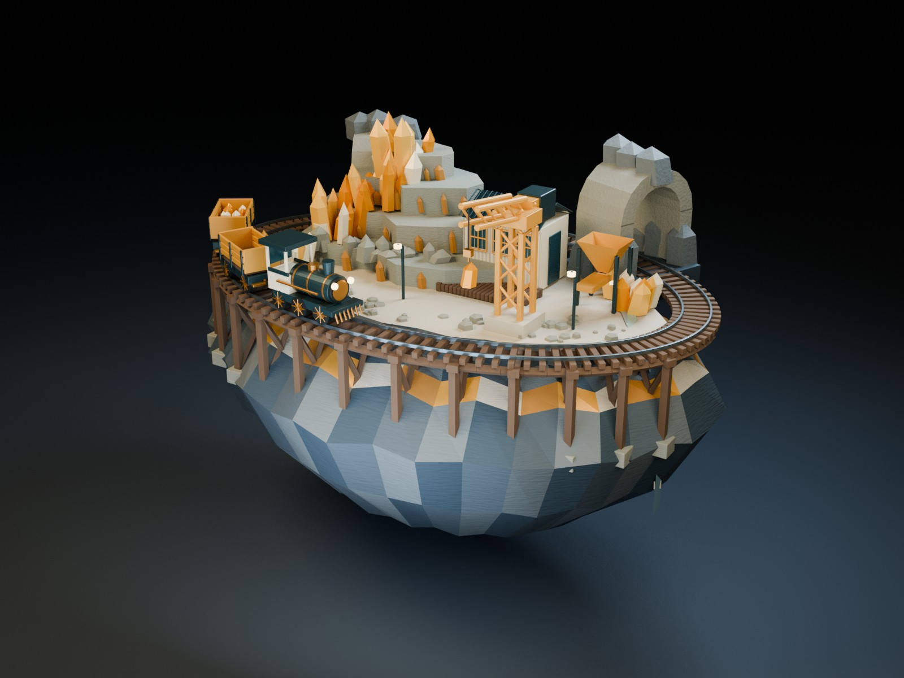
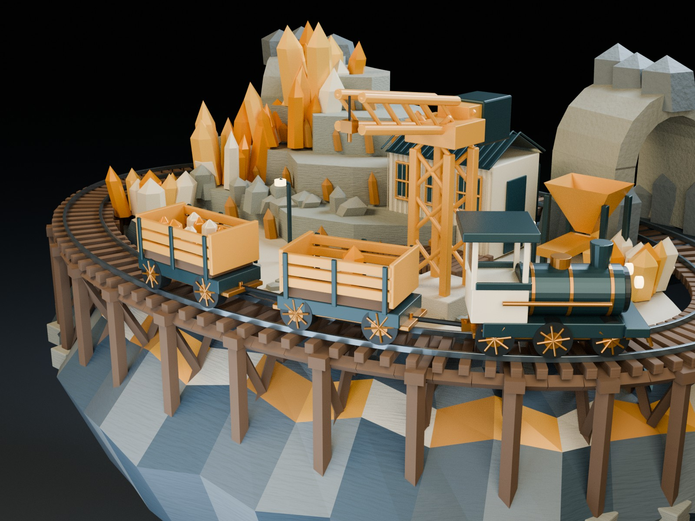

# A parametric rail kit becomes an editable animated quarry

Crystal Freight connects OpenSCAD, Blender and Kdenlive through actual DCC-MCP calls. Three transferred CAD parts preserve 4,423 vertices and 8,598 faces. A 148-object native scene stages one freight pickup across 120 rendered positions at 12 fps. The finished 20-second, 24 fps film has 480 frames. The corrected editor project now exposes all seven native caption controls and passed untouched Save Copy, reopen and full-frame export comparisons.

[Hero](hero.jpg) · [Detail](detail.jpg) · [Film](film-1280.mp4) · [Contact sheet](film-contact-sheet.jpg) · [Editable core](editable-core.zip) · [Downloads and hashes](downloads.json) · [Package members](native-package.json) · [Actual MCP excerpts](mcp-evidence.public.json) · [Methods](METHODS.md) · [SCAD header proof](source-header-change.json) · [Rights](LICENSES.md) · [Privacy](privacy-audit.json) · [Validation](validation.json) · [Manifest](manifest.json)

## One freight pickup

The locomotive brings an empty wagon under the hoist. An amber crystal is lowered onto the wagon floor; the hook retracts and the train departs through a stone gateway. The native file retains geometry, materials, cameras and kinematic keyframes.

| Check | Recorded result |
| --- | --- |
| Kit | 600 mm rail gauge, 112 sleepers |
| CAD transfer | 4,423 vertices and 8,598 faces preserved after mm-to-m conversion |
| Scene | 148 objects, 132 meshes |
| Motion | 120 native frames at 12 fps; 115 distinct images including deliberate holds |
| Film | 1280 × 960, 480 frames, 24 fps, 20 seconds |
| Scene relocation | Four native Blender copies reopened and reproduced their reference RGBA pixels |
| Corrected timeline | Seven native dynamictext controls, 122 relative PNG dependencies |
| Editor qualification | Native controls visible; untouched Save Copy and reopen; every RGB/RGBA frame and MP4 bytes match within the same display environment |

## Open the sources

The compact download contains self-contained SCAD, geometry exchanges, four native Blender scenes, still masters and the corrected Kdenlive timeline. Blender's action scene and CAD kit open from the compact package alone. The Kdenlive timeline needs the 122 PNGs in the full companion. Download availability, sizes and SHA-256 are recorded in downloads.json.

To use the full companion, extract it into a fresh directory and open blender/crystal-freight.blend or kdenlive/project.kdenlive. Keep kdenlive/media next to that project. The full companion includes the compact package's native content, so it does not require a second extraction. Use OpenSCAD 2021.01, Blender 4.3.2, or Kdenlive 24.12.3 with MLT 7.30.0 for the recorded environment. Install DejaVu Sans separately for editable captions. The development scene is a matched-pose reconstruction of an earlier revision, not an untouched historical screenshot.

## What changed in the editor

Earlier image readers produced white native previews. The corrected project uses qimage PNG readers, an empty portable root and the native dynamictext identity. Its 122 media files and qualified project bytes are unchanged in this publication package. The earlier accepted movie and source-unavailable relocation each matched all 480 frames. A separate GUI check exposed all seven caption controls, saved an untouched copy, reopened it outside the project directory and reproduced all 480 RGB/RGBA frames and the MP4 bytes within that display environment. These two render environments have different MP4 hashes; no cross-environment equality is claimed.

## Evidence and limits

The public MCP file contains selected real request and structured-result excerpts. It is not a complete trace or a turnkey adapter installation. Private paths, routing details and raw logs are omitted. The case's measured geometry, original failures and acceptance boundaries are recorded in validation.json. This publication preserves the accepted BLEND/editor/media bytes. The SCAD file has one documented attribution-comment correction; all executable source bytes remain identical. No fresh host run was performed.

The first gateway clearance and an earlier body-envelope pass failed before revision. JPEG preflight and an empty render-buffer route also failed. Their failure records remain in validation.json. Final parameter editing and parameter Undo were not qualified by the untouched-save test.

This is a silent, deliberately stepped kinematic miniature. It does not establish railway safety, continuous-time collision freedom, rigid-body physics or a seamless loop. The case assets are published with rights reserved as described in LICENSES.md; the site's MIT license does not license the artwork.
