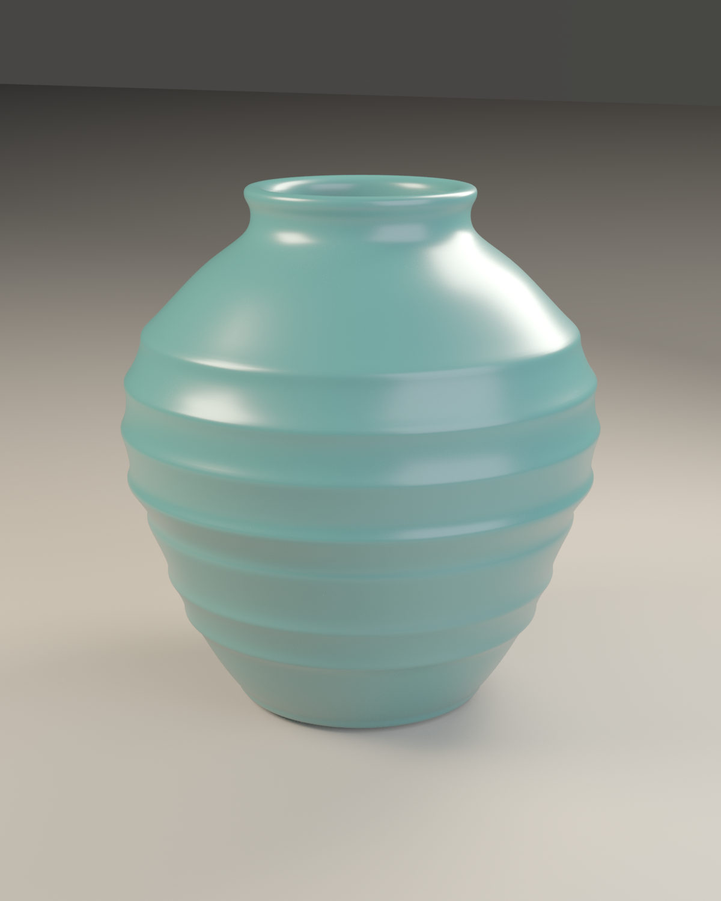
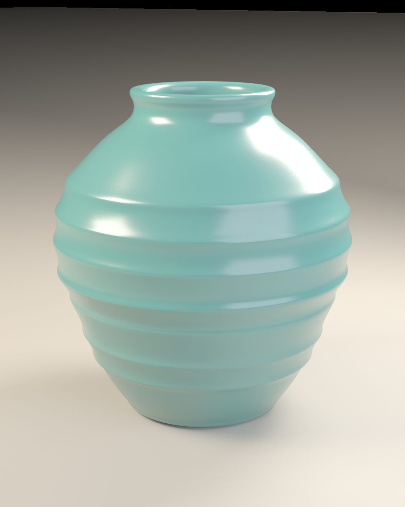
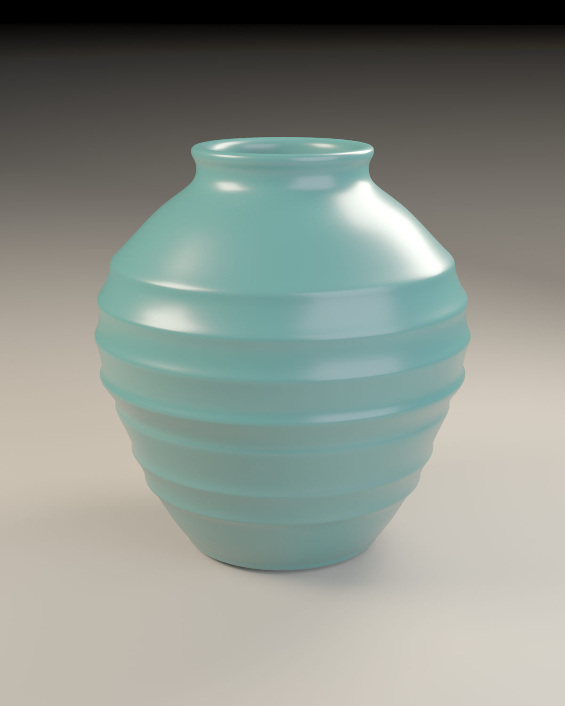

# 青釉环纹器皿：从剖面到真实 Mantra 成图

51 个剖面控制点定义外壁、环纹、口沿、内壁和底厚。144 段旋转与两级细分把它们变成可编辑的程序模型，再以釉面材质、三块软箱灯和独立相机完成产品式主图。

**本轮实际运行 · DCC-MCP 创作。** 建模、材质、灯光、相机、保存、Mantra 渲染及工程重开均在本轮专属 Houdini standalone 宿主中，通过 `dcc-mcp-cli call` 的专用 typed 工具完成。公开 PNG 的元数据整理使用已发现的 MCP 自动化能力，作为明确记录的 typed 能力缺口。每次正式调用要求 gateway 路由并记录统计。普通 shell 用于官方适配器启动、CLI 调度、文件审计和网页图片编码。

[可复用提示词](prompt.md) · [剖面输入](profile.json) · [typed 复用步骤](recipe.json) · [实际调用响应](calls.json) · [验证记录](validation.json) · [文件与哈希](manifest.json) · [网页图片映射](derivatives.json) · [许可](LICENSE.txt)

复用时先通过官方适配器入口启动自己拥有的空 Houdini 宿主，inventory 核对归属，再运行 [CLI 重放入口](replay-cli.ps1)：`./replay-cli.ps1 -InstanceId <INSTANCE_ID> -CaseDirectory <CASE_DIR> -Render`。该入口逐步 scoped search、按返回信息 load-skill、核实空场景、替换目录占位符并等待依赖作业；全部造型和渲染仍经 CLI 的 typed MCP 调用。recipe 含实际 51 点与完整最终参数。此重放入口经过语法与 22 个独立 AST guard fixture 检查，并在第二个独立空宿主完成不带 `-Render` 的烟测：47 个配方步骤及空场景、最终几何读回通过，导出 OBJ 与首轮成品逐字节相同。该烟测没有重复 Mantra 渲染；实际 gateway 为观察到的 0.20.22 过渡运行时，主案例生产 0.20.28 gateway 记录保持独立。详见 [重放烟测](replay-smoke.json)。

## 目标

制作一件比例清楚、有真实内壁和底厚的陶瓷器皿。环纹由剖面几何形成，颜色与釉层由 Houdini Principled Shader 控制，不使用外部贴图。主图保留口沿、肩部和底部的轮廓，地面顶面为 y=0，器皿最低点同为 y=0。

## 实际过程

1. 清点宿主并读取场景，确认专属宿主是空场景。已有其他任务的 Houdini 场景没有被修改。
2. `create_curve_guides` 写入 51 个剖面控制点；`lathe_profile` 围绕 Y 轴旋转 144 段，得到 7,344 点、7,200 面的车削网格。
3. typed `create_node`、`connect_nodes` 和 `set_node_parms` 建立两级 Subdivide；`add_normals` 生成顶点法线，输出 SOP 经独立读回核对。
4. `create_material` 与 `assign_material` 建立青釉和暖灰地面。最终釉面 roughness=0.30、coat=0.35、coatrough=0.24。
5. `create_camera`、`create_light` 与 typed 参数设置建立 90 mm 焦距镜头、三块 grid 软箱、注视目标和 1,000×1,000 地面。
6. 保存工程并执行第一轮真实 Mantra 预览。依据真实图像扩大地面、增加构图留白、降低主光与轮廓光，并提高粗糙度；随后建立背板，并依据渲染亮度调整背板色调。四个实际单帧作业的结果保留在调用记录中。
7. 最终 Mantra 采用 PBR Ray Tracing、4×4 像素采样、最多 16 条次级射线，以 `$HIP/hero.png` 输出单帧。渲染作业使用适配器的隔离快照及独立 worker。
8. 重开本轮保存的工程，再读回几何、相机、材质和输出设置。详细结果以 `validation.json` 为准。

预览保留最初的强反射和较紧构图，作为实际中间成果；最终图展示后续灯光、构图和背景调整的结果。JPEG 仅是网页编码副本，没有改变构图、颜色或加入生成像素。

这张中间图仍有未遮住的黑色天空，帮助说明后续建立背板的原因。其原 PNG 在下一次实际渲染时被覆盖；当时记录的 PNG 哈希和保留下来的 JPEG 字节均列在 `derivatives.json`。

## 可下载内容与原工程

[公开资源包：OBJ、像素一致的公开 PNG、复用输入和证据](https://github.com/dcc-mcp/showcase/releases/download/2026-10-01-houdini-procedural-study/houdini-procedural-study-assets.zip)。OBJ 由 typed `export_geometry` 实际导出，再由 typed `import_geometry` 回导入同一 Houdini 版本，点数、面数和包围盒一致。OBJ 提供最终几何及法线，不能保留 HIP 的程序化 SOP 链、完整着色器和灯光场景。

原始 PNG 的自动 Artist 字段包含本地登录元数据，原件保留私有。专用 typed 元数据整理工具未找到；通过已发现的 `houdini_automation__run_python_file` 正式 MCP 能力执行 [参数化清理代码](sanitize_png_metadata.py)，只移除 Artist 文本 chunk，输出明确命名的 `hero-public.png` 和 `preview-public.png`。CRC、压缩 IDAT 哈希、解码 RGBA 哈希和尺寸逐项验证一致，另用独立 Pillow 解码比较像素。公开副本不是未经元数据整理的原始字节；完整变化与哈希见 [PNG 发布记录](png-publication.json)。

原生 `CASE.hip` 已在本地保存并实际重开。它的 CPIO 成员、节点作者字段、内嵌 Stash 几何和项目变量包含私人作者、主机及路径元数据；现有 typed 保存与项目工具无法完整净化，所以 **HIP 暂不公开，也不包含在资源 ZIP 中**。公开 `profile.json` 和 `recipe.json` 提供模型与场景的复用输入，实际运行结果以 `calls.json` 为证。

## 环境与来源

- Houdini 22.0.368，Python 3.13.10，Mantra。
- 实际适配器 dcc-mcp-houdini 0.43.1；运行源码为干净 checkout `9957e58e987147e448819384a0e8a8be5756de18`，不是把当前远端 HEAD 当作运行版本。
- dcc-mcp-core、CLI 与专属 gateway 均为 0.20.28。Gateway 使用已存在的版本匹配二进制；没有升级安装、替换全局 PATH 或更改系统安全设置。
- [实际适配器源码](https://github.com/dcc-mcp/dcc-mcp-houdini/tree/9957e58e987147e448819384a0e8a8be5756de18)。该链接证明工具代码版本；本作品的文件哈希在本目录 manifest 中。

## 证据范围与限制

`calls.json` 是真实 CLI 响应的公开脱敏副本，保留 typed 工具名、结果、几何计数、渲染验证和 gateway 路由；移除了私有宿主标识、进程号及内部路径。`CASE_DIR` 代表用户选择的案例目录，`JOB_DIR` 代表适配器隔离作业目录，`PRIVATE_NATIVE_DIR` 代表保留未公开 HIP 的本地目录。原始日志保留在本地任务证据目录。早期调用只保存了响应；后期同时保存请求。`recipe.json` 根据实际执行的 CLI 输入整理，不冒充早期原始请求日志。

首轮 `set_render_settings` 回报分辨率 640×800，但实际输出仍为相机设置的 960×1200。本轮最终通过 typed 相机参数显式设置 1200×1500，并核对真实 PNG 尺寸；不把工具的 applied 字段单独作为成图证据。专属 loopback gateway 用于避开机器上并发运行时的版本接管，未改动其他宿主。

本例验证保存、重开、计数、渲染落盘、相对输出路径及同一 Houdini 的 OBJ 回导入；未在其他 DCC 重导入 OBJ 验证，也未验证 GUI 交互、其他 Houdini 版本、Karma、动画或封闭流形认证。程序化控制链保存在本地 HIP，公开几何采用 OBJ。

## 作者与许可

本轮由 DCC-MCP showcase 任务通过 typed DCC-MCP 生成，未使用外部模型、图片或纹理。案例文档、模型及渲染按本仓库 MIT 许可提供；SideFX 软件和内置着色器不作为独立库重新分发。`LICENSE.txt` 保留许可全文。
