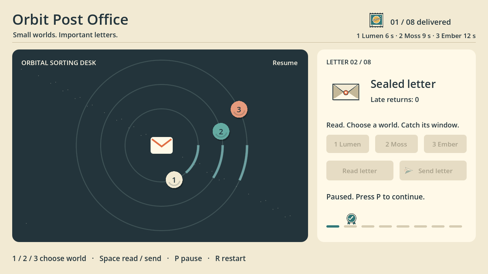
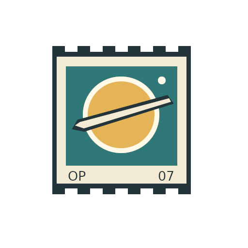
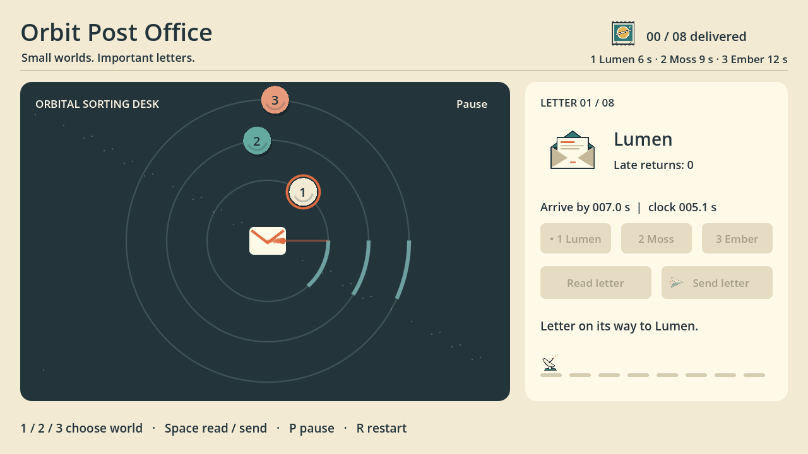
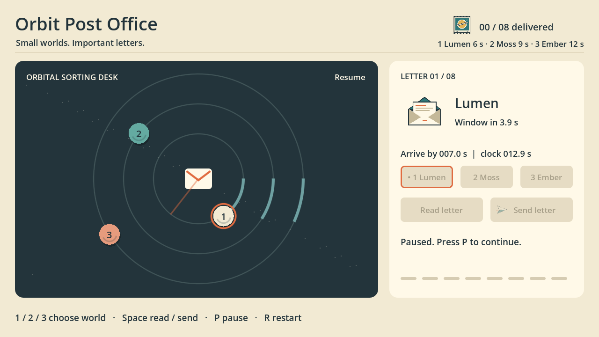
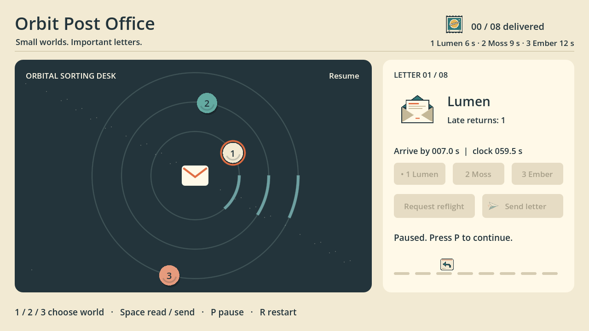
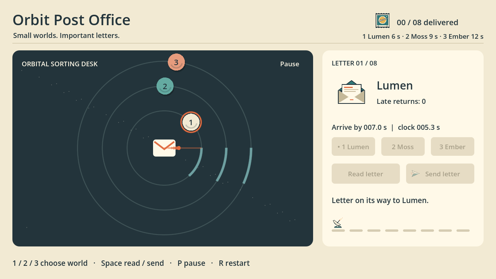

# 星间邮局：分层原画进入可编辑原生小游戏，保留验证中的失败

GIMP 的 8 个角色、76 个绘画图层与 2 个可编辑文字层，进入 Godot 的
29 节点、6 信号场景。自动回放分别完成正常 8 次投递和含迟到的 8 投递 / 1 迟到 /
9 次尝试；代表性代理键鼠操作与相同 48 文件的恢复工程冷启动另有原生证明。
主图只显示正常投递 01/08 后暂停，不能作为完整班次通关图。
严格 Vulkan 日志、50 ms 性能门槛和迟到重投组样本上限仍为 FAIL。

[精确原生 ZIP](Orbit-Post-Office-D058-final-review-v1.zip) · [下载与 SHA-256](downloads.json) · [验证](validation.json) · [清单](manifest.json) · [方法](METHODS.md) · [工具/技能范围](capability-coverage.json) · [素材索引](ASSET-INDEX.json) · [运行 pins](RUNTIME-PINS.json) · [权利](LICENSES.md) · [展开信](open-envelope.png) · [邮票](orbital-stamp.png) · [正常在途](run11-relocated-success-inflight.png) · [迟到在途](run11-late-inflight.png) · [焦点操作](manual-group-a-focused-shortcut.png) · [迟到退回](manual-group-b-late-return.png) · [正常投递](restored-normal-delivery.png)

## 从绘画到交互

纸色、深蓝轮廓与珊瑚/薄荷强调色统一了信件、邮票、包裹和状态印章。
原画为 512 × 512 RGBA/U8，sRGB、straight alpha；邮票保留 DejaVu Sans Book
文字。完整包附 128/64 像素与浅深底原生预览。4 批真实 GIMP MCP 复现比较了
40 份 XCF 的字节和 88 份 PNG 的解码 RGBA，结果一致。

Godot 用相对资源路径连接 8 个 PNG。读信、选目标、等窗口、发送、迟到退回与
重新投递组成一班 8 封信。下面的实际在途帧来自自动回放，显示第一封信尚未送达。

## 同时展示通过与失败

| 验证对象 | 实际观察 | 边界 |
| --- | --- | --- |
| 正常完整回放 | 8 投递、0 迟到、8 次尝试，tick 1920 | 自动回放 |
| 迟到完整回放 | 8 投递、1 迟到、9 次尝试，tick 2640 | 自动回放 |
| 代理键鼠 | 错误航线、暂停无动作、Tab/Enter、Space、正常投递、已填充状态重启 | 代表性交互，不是人类完整通关 |
| 恢复工程 | 48 个文件、910,075 字节与原生冷启动证明一致 | MCP 辅助 Linux 条件 |
| 严格日志 | 已知 Vulkan 错误，FAIL | 功能通过不抵消日志失败 |
| 50 ms 进程观察门槛 | run11 超限 103 次；恢复运行超限 76 次 | 200 ms 中止阈值不是性能 PASS |
| 迟到重投组 B | 样本上限 FAIL；一次重投成功有根状态读回 | 无完整成功检查点或成功 PNG |

## 下载、打开与编辑

下载上面的原生 ZIP，先核对 [downloads.json](downloads.json) 的完整 SHA-256，
再解压到新目录。进入 Orbit-Post-Office-D058-final-review 目录，执行
`python3 verify_files.py`，确认文件校验通过，再用 Godot 4.6.3 导入
`game/project.godot`。场景为 `game/scenes/orbit_post.tscn`，规则位于
`game/scripts/orbit_post.gd`，分层 XCF 位于 `game/source-art/`。

Run Project 后，鼠标或 Space 负责开始/读信/发送/重试；1/2/3 选择
Lumen/Moss/Ember，P 暂停，R 重启，Tab/Enter 使用原生焦点。
内置成功/迟到回放选择器是另一个自动化 fixture，不是实际外部键鼠输入记录。

用 GIMP 3.0.4 打开 XCF，在副本中编辑已有图层，保持透明 PNG 的尺寸、sRGB
和 straight alpha。修改任何源文件后就产生新版本，旧证据的字节一致性不再适用。
完整 GIMP MCP 重建说明在包内 `gimp-reproduction/REPRODUCE.md`；Godot
适配器公开基线与未发布补丁在 `RUNTIME-PINS.json` 及 references 归档中。
精确版本、依赖和字体要求应一并核对，不能仅靠相同版本号推断同一构建。

## 证据与边界

5,015 行仅为 Godot authoring run07、replay run11、manual A/B、restored-native
及清理的完整归一化逻辑流：2,482 个工具请求、2,480 个结果、3 个异常记录。
它不是所有历史尝试，也不包括全部 GIMP 历史原始轨迹，更不是原始网络抓包。
GIMP 的独立包提供 783 条选定证据；其 162 项创作操作与任务、轮询分开计算。
详细范围见 [工具与技能记录](capability-coverage.json)。

最终 ZIP 为 3,214,346 字节、144 个成员，独立文件审核覆盖 338 个递归对象。
网页使用的 5 个原生帧及 2 个绘画导出保持源 PNG 字节不变，未裁切、缩放或重绘。
冷启动证明绑定相同的游戏文件，不声称更新后的证据包装 ZIP 再次原生打开。
包内编辑器插件和运行 autoload 保持启用；其初始化会尝试连接 MCP bridge。
普通无监听器启动、Windows、跨机器像素一致均未验证。Godot 使用固定开发补丁，
不冒称官方发行能力；没有影片、网页可玩导出或应用程序二进制。

合并前验证采用静态模板与文件检查；公开页面的桌面/移动浏览器验收、
筛选、键盘路径和下载字节核验仍待部署后完成。
作品、游戏内容与配方保留权利，详见 [权利与来源](LICENSES.md)。
