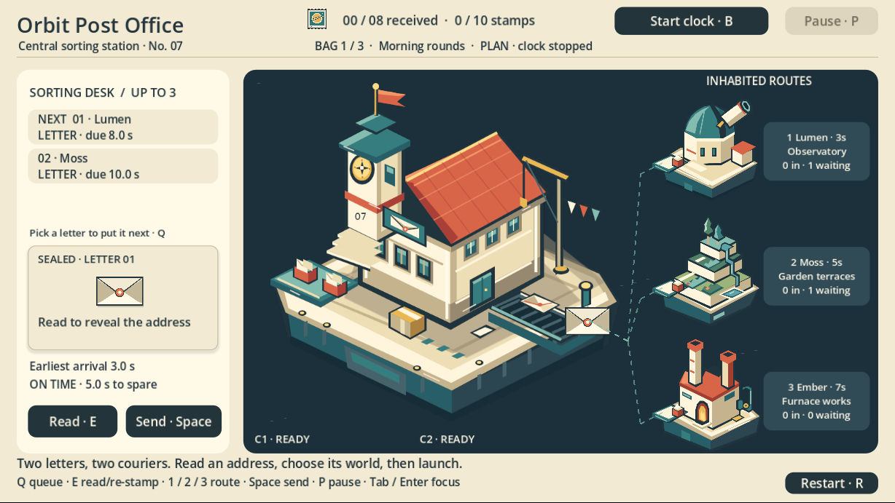
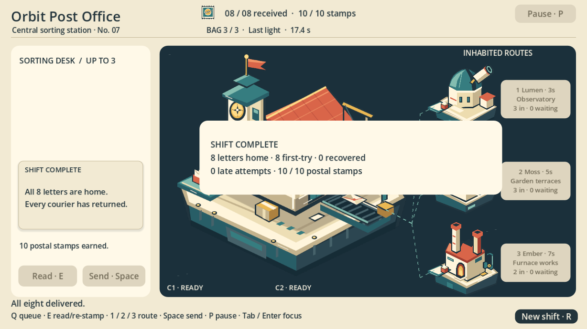

# Orbit Post Office: native GIMP artwork, an eight-letter game and a seven-second film

Four new layered GIMP worlds became a native Godot postal-routing game and a seven-second, 1280 × 720, 30 fps Kdenlive film. Separate native gameplay checks completed eight letters, ten stamps and all couriers returned. The film shows only the first delivery. This page publishes the finished MP4, actual images and selected evidence; **the current game, artwork and film source projects are not publicly downloadable**.

[ASSET-INDEX.json](ASSET-INDEX.json) | [LICENSES.md](LICENSES.md) | [METHODS.md](METHODS.md) | [Historical v1 archive](Orbit-Post-Office-D058-final-review-v1.zip) | [RUNTIME-PINS.json](RUNTIME-PINS.json) | [capability-coverage.json](capability-coverage.json) | [Full shift](completed-shift-native.png) | [downloads.json](downloads.json) | [Ember art](ember.png) | [film-validation.json](film-validation.json) | [Final film](first-delivery-720p.mp4) | [historical-v1/ASSET-INDEX.json](historical-v1/ASSET-INDEX.json) | [historical-v1/METHODS.md](historical-v1/METHODS.md) | [historical-v1/README.md](historical-v1/README.md) | [historical-v1/RUNTIME-PINS.json](historical-v1/RUNTIME-PINS.json) | [historical-v1/capability-coverage.json](historical-v1/capability-coverage.json) | [historical-v1/downloads.json](historical-v1/downloads.json) | [historical-v1/manifest.json](historical-v1/manifest.json) | [historical-v1/validation.json](historical-v1/validation.json) | [Lumen art](lumen.png) | [Manifest](manifest.json) | [manual-group-a-focused-shortcut.png](manual-group-a-focused-shortcut.png) | [manual-group-b-late-return.png](manual-group-b-late-return.png) | [Moss art](moss.png) | [native-art-pixel-qualification.json](native-art-pixel-qualification.json) | [open-envelope.png](open-envelope.png) | [orbital-stamp.png](orbital-stamp.png) | [restored-normal-delivery.png](restored-normal-delivery.png) | [run11-late-inflight.png](run11-late-inflight.png) | [run11-relocated-success-inflight.png](run11-relocated-success-inflight.png) | [selected-native-evidence.json](selected-native-evidence.json) | [Station art](sorting-station.png) | [Native opening](standalone-main-native.jpg) | [Validation](validation.json)

## The finished first-delivery film

[Watch or download the seven-second MP4](first-delivery-720p.mp4). It contains two seconds of original station art and title, four seconds of actual Godot gameplay and a one-second end card, with intentionally silent audio. Current recovery checks decoded all 210 frames and measured zero audio amplitude. The earlier film qualification recorded all 120 gameplay frames within RGB MAE ≤ 3 and RMSE ≤ 10 on a 0–255 scale; that comparison is historical. H.264 pixels are not claimed to be lossless copies of the PNG sources.

The retained native Kdenlive project preserves five editable Dynamic Text effects, the station Transform and all 117 media dependencies. A native Save Copy and subsequent portable re-export reproduce the final MP4 byte-for-byte. The clean relocated project opened from an unrelated working directory without missing-media prompts, played through the end card and exited normally, leaving all 119 native files unchanged. These are recorded historical source-qualification results. Publication recovery verified the retained project structure and media, but did not rerun the native applications. See [film validation](film-validation.json).

## Original layered worlds

The station combines a clock tower, sorting counter, mailboxes, parcels, crane and conveyor. It has 36 editable nodes; each destination has 11. The four new masters are 768 × 768; six reused icon masters are 512 × 512 and retain historical qualification.

| World | Native export | Role |
| --- | --- | --- |
| Lumen | [Observatory](lumen.png) | Receiving station for the night keeper |
| Moss | [Garden terraces](moss.png) | Receiving station for gardeners |
| Ember | [Furnace works](ember.png) | Receiving station for the furnace crew |

Four new XCFs were relocated, reopened natively and re-exported. Their saved bytes, layers and metadata matched, and decoded RGBA, alpha and standard sRGB semantics agreed. That current relocation claim does not include the six reused icons. [Asset index](ASSET-INDEX.json) paths refer to the retained native projects; they are not current public file links. [Pixel qualification](native-art-pixel-qualification.json) records the measured comparisons.

## Native gameplay and recovery

Actual typed inputs and native state readbacks completed eight letters across three bags using two couriers: ten stamps, zero late attempts and all couriers returned. Wrong destinations were rejected. A separate cold-control run verified native button signals, Tab/Enter activation, restart during courier return with a visible receipt, and late return followed by successful re-stamping. The retained acceptance summary records that separate first-letter recovery. Its later PNG was not recovered for this publication, so no current recovery image is presented.

A fresh 33-file game copy launched its saved main scene through normal F5 without an addon, Core, SDK or listener. Its actual frame was inspected; F8 stopped it and the editor quit normally. All 33 source files remained unchanged. [Selected native evidence](selected-native-evidence.json) separates game results, operation categories and original receipt hashes; it is not a raw transport transcript.

## Reproduction and inspection

The public artifacts can be inspected without running a DCC application: play the MP4, open the native images and compare their byte counts and SHA-256 values with [the manifest](manifest.json). [Downloads](downloads.json) lists the MP4 and the explicitly historical v1 archive. Exact reproduction of the current native project requires source files that are not publicly downloadable here.

Recorded native opening used Godot 4.6.3 with its saved `game/project.godot` main scene, GIMP 3.0.4 for the XCF masters, and Kdenlive 24.12.3 / MLT 7.30.0 with DejaVu Sans for the film. The retained film has 211-frame outer metadata; its intended export is inclusive frames 0–209, yielding seven seconds of video. Silent AAC padding brings the container to 7.018 seconds. These settings describe the completed native checks rather than visitor download instructions. See [methods](METHODS.md) and [runtime/source pins](RUNTIME-PINS.json).

## Boundaries, failures and history

Current game/art/film project downloads remain unavailable publicly; the [historical v1 archive](Orbit-Post-Office-D058-final-review-v1.zip) and [historical report](historical-v1/README.md) describe the earlier icon-focused prototype. They are not substitutes for the station-and-worlds game shown here. Their older images and metadata remain linked in the artifact row for traceability.

Standalone audio fallback, V-Sync and Vulkan surface-extension warnings remain recorded. Ember's original whole-run deadline failure remains despite later successful art checks. Kdenlive's original instantaneous shutdown-gate failure remains separate from its later cleanup and accepted artifacts. An optional Frei0r startup warning was observed; no Frei0r effect is used. Qualification is limited to the tested Linux environment; no warning-free, cross-platform, full-adapter or human-endorsement claim is made. Native button signals are not OS mouse-coordinate evidence, and the separate game OS exit code was not observed.

Exact-head CI checks the public pages on desktop and mobile. Public player and downloaded-MP4 acceptance follows deployment. This page provides no browser-playable game or application binary. Original artwork, game content, recipes, film and source projects remain rights reserved; no new MIT or CC0 grant is made. Read [rights and scoped notices](LICENSES.md).

## Model and version attribution

Original planning, artwork, DCC operation, code, reference generation and film-making model names and reasoning effort are unrecorded in the retained production evidence. They remain unknown. The case page separately records the current publication review configuration and its limited scope; it cannot establish historical creation identity or backend identity. This update presents the station/worlds revision and seven-second film while preserving the earlier icon prototype unchanged.

## 2026-10-09 · Added native REAPER score

[Play/download the newly scored film](orbit-post-office-scored.mp4). [Native MIDI project, original sources, skills and lossless WAV](orbit-post-office-native-score.zip).

The original silent film remains unchanged. This new version uses 29 editable native MIDI notes with stock REAPER ReaSynth, plus separately labeled original procedural SFX. A real typed DCC-MCP workflow composed notes, configured actual instrument parameters, saved/reopened the RPP and rendered an exact 7.0-second stereo 48 kHz/24-bit master. Native peak normalization targets -3 dBFS with short endpoint fades.

FFmpeg only copied the unchanged H.264 stream and encoded the actual native master to AAC. Every decoded video frame, frame count and picture duration matches the original; AAC aligns to the native master with zero sample offset. [Media checks](soundtrack-media-qa.json), [native state](soundtrack-native-audit.json), [native signal checks](soundtrack-native-validation.json), [cue timings](soundtrack-cues.json) and [scoped soundtrack rights](SOUNDTRACK-LICENSES.md) are retained. Fine cue timings follow public visual sampling, approximately ±0.25 s for non-edit events. No subjective listening or private game integration is claimed.

See the [Trail & Air audio workflow](https://dcc-mcp.github.io/showcase/cases/trail-and-air/) for the related reusable audio pipeline. Original visual rights are unchanged; CC0 applies only to new standalone audio.
