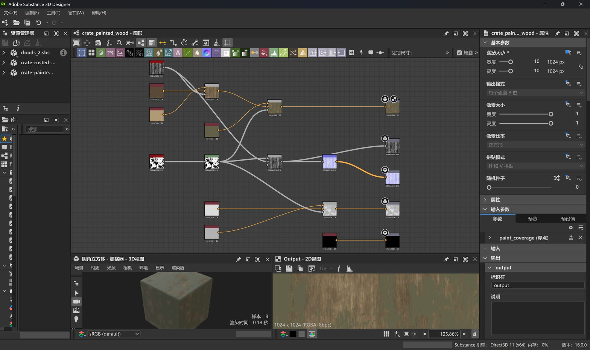
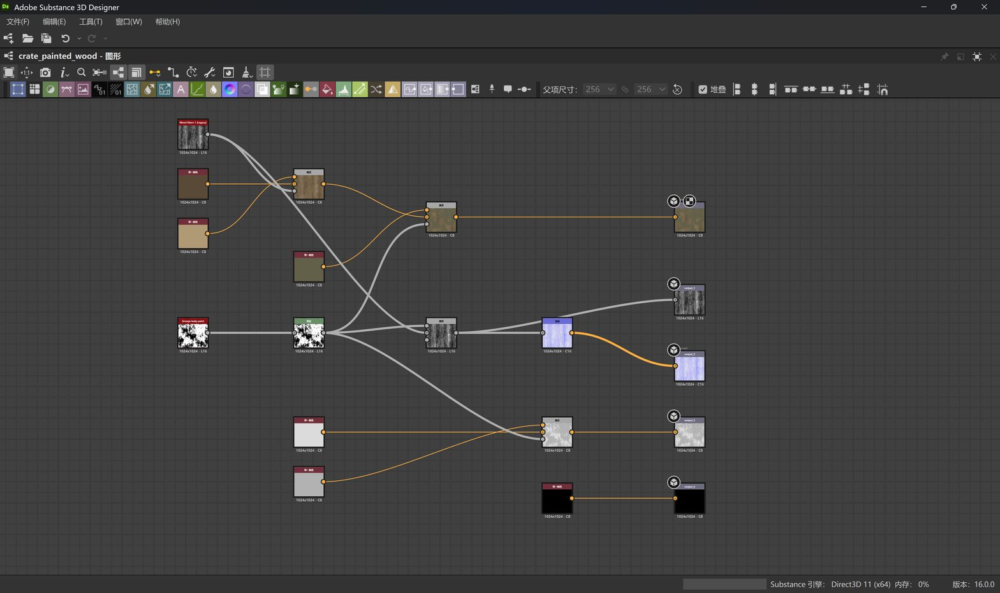
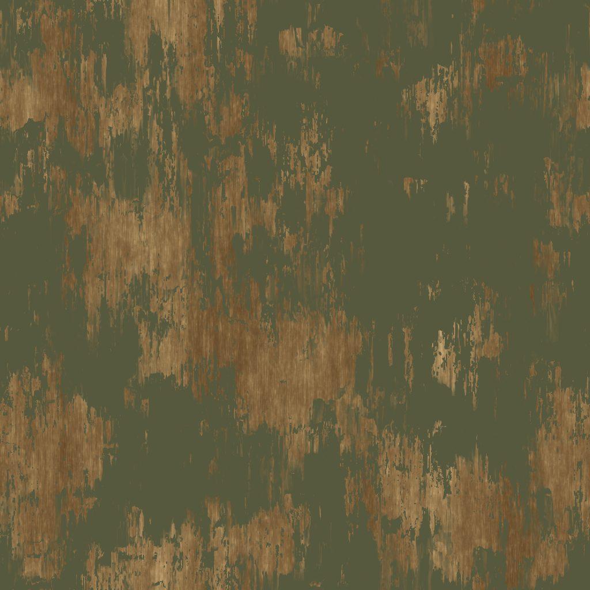
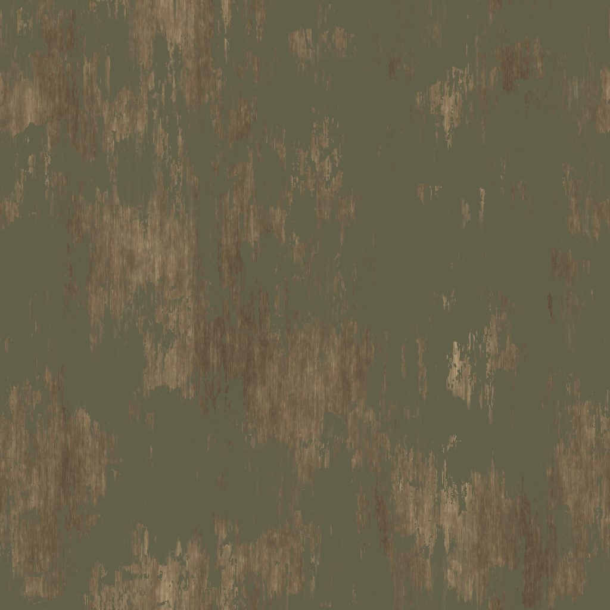

# 橄榄绿旧漆木材：从生成参考到可编辑的程序化表面

19 个作者节点把木纤维、裸木颜色和剥落油漆变成可编辑的 PBR 材质。颜色校正有前后图，paint_coverage 暴露为参数，五类原生输出保留明确的位深和色彩解释。

> **公开案例 · 本轮未复现。** 整合源仓库 2026-09-10 发布的 Designer 图、前后颜色图、原生贴图与文件清单。公开报告声明通过 DCC-MCP 编写实时材质图；本轮核对 5 张原图哈希并制作网页副本，没有启动 Designer。源包未提供 validation.json、原始提示词、完整 tools/call 日志或 adapter/core 版本。

[hero.jpg](hero.jpg) · [before.jpg](before.jpg) · [color.jpg](color.jpg) · [graph.jpg](graph.jpg) · [reference.jpg](reference.jpg) · [验证与证据范围](validation.json) · [文件清单](manifest.json) · [原图/网页副本映射](derivatives.json) · [源许可](LICENSE.source.txt)

## 目标与介绍

以已有生成木箱参考的表面为视觉目标，建立一套不使用参考图像素烘焙的程序化旧漆木材。保留可调油漆覆盖率、裸木颜色、木纹高度与粗糙度，并导出能用于其他渲染软件的原生 PBR 通道。

## 提示词

**可复用改写，原始提示词未公开，本轮未执行。**

通过 DCC-MCP 在 Substance 3D Designer 16 中制作可编辑的橄榄绿旧漆木材。已有木箱参考仅用于观察颜色和磨损，不把参考图像素烘焙进材质。用 Wood Fibers 1 建立木纹，以两种裸木颜色混合；用 Grunge Leaky Paint 与 Levels 建立剥落油漆遮罩，并驱动粗糙度、Height 与 Normal，Metallic 保持零。暴露 paint_coverage 参数并保存为 0.70。将油漆 RGB 由 87/89/62 校正为 99/96/74，裸木端点校正为 0.35/0.29/0.215 与 0.69/0.60/0.46。原生导出 1024×1024 的 Base Color、Height、Normal、Roughness、Metallic，保存 SBS 与 SBSAR，拍摄完整节点图和实时材质预览，记录文件哈希及实际工具调用。缺少能力时报告限制，不绕用直接软件脚本。

原始对话提示词未公开。此文本根据公开步骤改写，供未来复现使用；不是原话，本轮未执行。原参考由 Codex 图像生成产生，材质图由源报告声明的实时 DCC-MCP 工作流制作。

## 软件与工具

| 项目 | 已公开信息 |
| --- | --- |
| 材质软件 | Substance 3D Designer 16.0.0 |
| 作者图 | crate_painted_wood · 19 nodes |
| 输出 | 1024 × 1024 · 5 PBR 通道 |
| 色彩工作流 | Designer legacy · 原生导出无额外 gamma 变换 |
| 图截图 | DCC-CUA 1.8.2 |
| 适配器 / Core | 未公开记录（unrecorded） |

- **DCC-MCP / Designer（源报告）**：源 README 和 manifest 声明通过 DCC-MCP 在实时 Designer 图中编写材质并导出。完整工具名、调用参数和轨迹未公开。
- **DCC-CUA 1.8.2**：原公开 manifest 记录截图 provider；完整节点图与实时 session 保留 2D 输出和预览信息。

## 分步过程

### 1. 把参考分解成表面特征

观察历史生成参考中的木纤维、裸木和橄榄绿剥落漆。参考用于艺术估计，不直接烘焙成贴图；本案例只做材质，未重建木箱几何或 UV。

### 2. 搭建 19 节点的材质图

Wood Fibers 1 驱动两种木色混合；Grunge Leaky Paint 和 Levels 控制油漆覆盖。磨损遮罩同时影响 Roughness，木纹和漆层起伏影响 Height 与 Normal，Metallic 为零。

### 3. 校正过绿、过黄的颜色

源报告记录油漆 RGB 从 87/89/62 改为 99/96/74；裸木端点由偏黄组合改为较中性的 0.35/0.29/0.215 与 0.69/0.60/0.46。颜色是从带光照参考作出的艺术估计。

### 4. 暴露油漆覆盖率并实时预览

paint_coverage 通过参数函数连接到油漆生成器的 balance，保存为 0.70。Designer 的圆角立方体只用于材质预览，不是最终木箱模型。

### 5. 导出原生 PBR 与可编辑源

五个 PBR 通道均为 1024×1024。Base Color 为 RGB8，Height 为 Gray16，Normal 为 RGBA16，Roughness 和 Metallic 为 RGB8。颜色按 sRGB，数据按 raw/non-color 使用，避免二次 gamma 变换。

## 最终与中间成果

公开实际 Designer session：19 节点图、2D 纹理和圆角立方体材质预览。

校正前：漆偏绿、裸木偏黄。

校正后：更中性的旧漆与裸木。

全部作者节点与连接；Adobe 库节点内部实现未展开。

## 验证证据

以下明确区分本轮资产核对与源报告的历史软件测量。

| 检查 | 结果 | 实际证据 |
| --- | --- | --- |
| 源图一致性（本轮） | 通过 | 5 张下载原图的 SHA-256 与源 manifest 一致；原图及网页副本分别记录哈希。 |
| 可编辑源与参数（历史记录） | 通过 | 源 manifest 记录 graph=crate_painted_wood、19 个作者节点、paint_coverage=0.7，公开 SBS/SBSAR。 |
| 输出规格（历史记录） | 通过 | 源 manifest 为五个 PBR 输出记录 1024×1024 尺寸及 PNG 位深，Normal RGBA16 / Height Gray16。 |
| 软件复现与完整 MCP 轨迹 | 未建立 | 本轮未运行 Designer；源包没有 validation.json 或完整 tools/call 轨迹，适配器与 Core 版本未记录。 |

JSON 字段中的未知记录明确为 null 或 unrecorded。本轮没有产生新的 DCC 渲染、执行日志或软件版本证明。

## 复用与资源

- [公开源案例](https://github.com/dcc-mcp/dcc-mcp-substance3d-designer/blob/38623dd51721a958b8dc5d2e8957e991908333ac/docs/showcase/painted-wood/README.md)
- [Editable SBS](https://github.com/dcc-mcp/dcc-mcp-substance3d-designer/blob/38623dd51721a958b8dc5d2e8957e991908333ac/docs/showcase/painted-wood/painted-wood.sbs)
- [SBSAR](https://github.com/dcc-mcp/dcc-mcp-substance3d-designer/blob/38623dd51721a958b8dc5d2e8957e991908333ac/docs/showcase/painted-wood/painted-wood.sbsar)
- [Base Color 原生 PNG](https://github.com/dcc-mcp/dcc-mcp-substance3d-designer/blob/38623dd51721a958b8dc5d2e8957e991908333ac/docs/showcase/painted-wood/baseColor.png)
- [Height 原生 PNG](https://github.com/dcc-mcp/dcc-mcp-substance3d-designer/blob/38623dd51721a958b8dc5d2e8957e991908333ac/docs/showcase/painted-wood/height.png)
- [Normal 原生 PNG](https://github.com/dcc-mcp/dcc-mcp-substance3d-designer/blob/38623dd51721a958b8dc5d2e8957e991908333ac/docs/showcase/painted-wood/normal.png)
- [Roughness 原生 PNG](https://github.com/dcc-mcp/dcc-mcp-substance3d-designer/blob/38623dd51721a958b8dc5d2e8957e991908333ac/docs/showcase/painted-wood/roughness.png)
- [Metallic 原生 PNG](https://github.com/dcc-mcp/dcc-mcp-substance3d-designer/blob/38623dd51721a958b8dc5d2e8957e991908333ac/docs/showcase/painted-wood/metallic.png)
- [历史生成参考](https://github.com/dcc-mcp/dcc-mcp-substance3d-designer/blob/38623dd51721a958b8dc5d2e8957e991908333ac/docs/showcase/painted-wood/reference.png)

建议先核对源清单中的哈希，再在已连接的真实 DCC-MCP 实例中打开资源、按可复用提示词运行并保留工具调用。本站保留的是历史证据，不承诺当前软件、适配器或插件组合能直接复现。

## 边界

- 本轮只核对公开资产哈希与来源，没有在 Designer 中重新执行，未证明当前适配器可复现。
- 公开案例没有原始提示词、validation.json、tools/call 日志或 adapter/core 版本。
- 历史参考图由 Codex 图像生成产生，属于参考输入；它不是程序化材质的导出结果。
- 圆角立方体是 Designer 预览网格。没有木箱几何、硬件、特定边缘磨损或 UV 重建。
- 颜色是艺术估计，不是物理 albedo 测量。Normal Y 方向仍须与目标渲染器匹配。
- 源仓库整体声明 MIT；作品、参考图和材质未另列许可。SBS 用 sbs:// 引用安装的 Adobe 标准库，本站不分发标准库源码。

## 来源、作者与许可

作者：Long Hao / loonghao · DCC-MCP。源仓库 MIT；作品与素材未另列独立许可。

源报告注明参考由 Codex 生成、材质和导出文件为该仓库创作。保留作者与源许可；Adobe 标准库内容仅引用、不分发。当前图片是原公开成果的网页派生副本。

固定来源：[公开源 README](https://github.com/dcc-mcp/dcc-mcp-substance3d-designer/blob/38623dd51721a958b8dc5d2e8957e991908333ac/docs/showcase/painted-wood/README.md)
源仓库提交：38623dd51721a958b8dc5d2e8957e991908333ac
合集元数据核对日期：2026-10-01（不是软件复现日期）。

网页 JPEG 来自固定提交的公开 PNG，仅缩放/压缩与透明背景合成，保留完整画面，未修饰成果或擦除失败信息。原图和网页副本分别记录 SHA-256；两者字节不同，不得把网页副本称为原始未改动 PNG。
